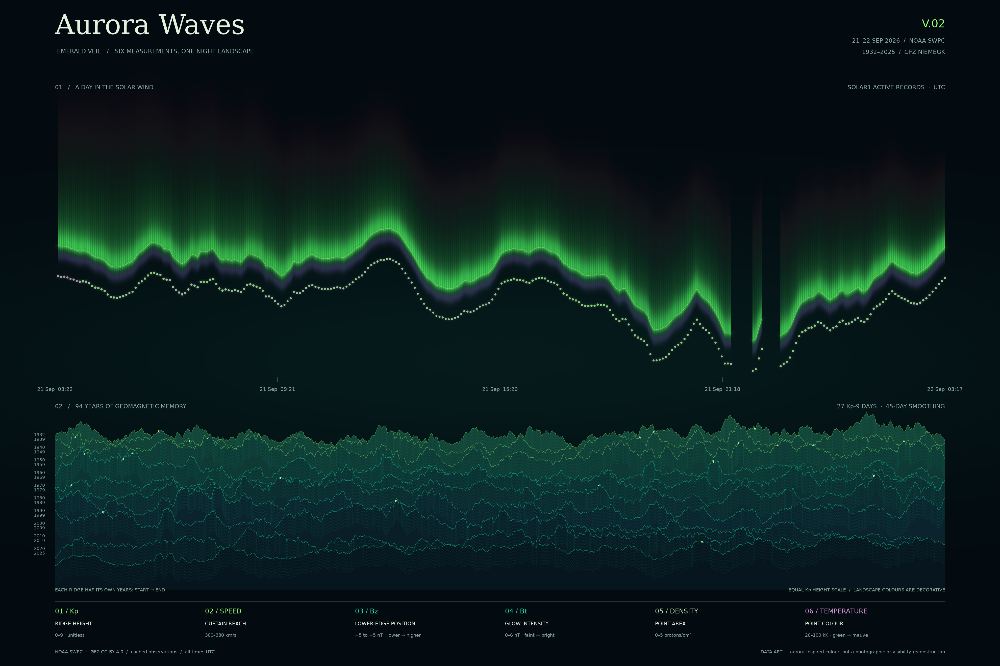

# Aurora Waves · V02 — Emerald Veil

> **Archived — V02.** A read-only snapshot of the current version. The working copy is at the [repository top level](../README.md); the raw data is shared from `../data/` rather than duplicated here.
>
> **归档说明**：这是第二版的只读快照。当前使用中的副本在[仓库顶层](../README.md)，原始数据统一放在顶层 `data/`。



This second version takes the mountain-and-curtain composition from the earlier Aurora Waves picture and gives it a quieter night palette. Pale green carries the brightest light, jade sits in the shadows, and a small purple border runs beneath the curtain. NOAA describes pale green as the most common auroral colour and notes that some auroras have a purple lower edge [1]. That informed the palette. The colours here are a design choice, not a reconstruction of what an observer would have seen.

I kept the same published data so the two versions can be compared without changing both the numbers and the design at once. The upper curtain uses NOAA solar-wind observations from 21–22 September 2026 UTC [2]. The lower mountain ranges use 94 complete years of GFZ Kp data, 1932–2025 [3]. The sky and mountains have separate timelines: horizontal position in the sky is recent UTC time, while each mountain runs from the beginning to the end of its labelled years.

## What the six measurements do

| Measurement | V02 encoding | Display scale |
|---|---|---|
| Historical Kp | Mountain height above its baseline | 0–9, unitless; same height scale on every range |
| Solar-wind speed | Vertical reach of the curtain | 300–380 km/s; longer for faster wind |
| Bz, GSM north–south component | Position of the curtain's lower edge | −5 to +5 nT; lower to higher |
| Bt, total magnetic field | Glow intensity | 0–6 nT; faint to bright |
| Proton density | Area of each light point | 0–5 protons/cm³; small to large |
| Proton temperature | Colour of each light point | 20,000–100,000 K; green to mauve |

The fixed display scales clip values outside their limits. Curtain reach, glow intensity and point area include small visible minimums. The Bz encoding is a graphic position on the page, not a geographic position or altitude. The purple hem and faint red upper glow are colour styling; their presence does not prove particular emissions were measured. Fine vertical filaments and repeated mountain contours are drawing textures, not additional data points.

## Data and transformations

The original replies remain unchanged in `data/`. The source addresses are in `fetch.py`.

| Saved file | Raw records | Meaning and use |
|---|---:|---|
| `gfz-kp-ap-since-1932.txt` | 276,784 | One three-hour Kp record; Kp is column eight. Daily maxima become historical ridges. |
| `swpc-solar-wind-mag-1m.json` | 3,496 | One spacecraft's one-minute magnetic measurement; Bt and Bz in nT. |
| `swpc-solar-wind-plasma-1m.json` | 3,374 | One spacecraft's one-minute speed, density and temperature measurement. |
| `swpc-planetary-k-index-1m.json` | 358 | Estimated Kp updates; retained for the plain first-look plot, not this image. |
| `swpc-ovation-aurora-latest.json` | 65,160 grid points | An exploratory aurora grid; retained but not used in this image. |

The NOAA files contain several spacecraft. The parser selects active records, interprets timestamps as UTC, sorts them and joins valid plasma and magnetic measurements at exactly matching minutes. This snapshot supplies 1,362 paired minutes from SOLAR1, forming 276 usable five-minute bins. Twelve bins have fewer than three matching samples and remain empty.

For the curtain's shape and brightness, V02 adds a centred nine-bin moving mean, equivalent to 45 minutes in a full valid run. Short runs use a smaller odd window; edges use endpoint padding. Interpolation adds drawing pixels only within each valid run. It never connects across a missing interval. Light-point area and colour retain the unsmoothed five-minute density and temperature values, while their positions follow the softened Bz edge. Each point represents one valid bin, not one physical particle.

Each historical ridge uses the same centred 45-day mean of daily maximum Kp as V01. Only complete calendar years enter the ranges; no extra leap days are invented. All 27 days reaching Kp 9 in those years are marked, although overlap can obscure some markers. Smoothing removes short fluctuations, overlap hides parts of the history, and the colour treatment does not predict aurora visibility. These are deliberate limits of a data artwork.

## Run V02

```sh
uv run aurora_waves_v02.py
```

This saves `out/aurora-waves-v02-emerald-veil.png` and opens a preview. To save without opening a window:

```sh
uv run aurora_waves_v02.py --no-show
```

Check the data and the new gap-handling logic:

```sh
uv run aurora_data.py
uv run test_data.py
uv run test_v02.py
```

`fetch.py` reuses the cached files. The plotting scripts work offline once their dependencies are installed. The original `aurora_waves.py` is retained because V02 reuses its data-loading functions; running it still creates the separate V01 filename `out/aurora-waves.png`.

## References

[1] NOAA Space Weather Prediction Center. Aurora Tutorial [EB/OL]. [2026-09-22]. https://www.spaceweather.gov/content/aurora-tutorial

[2] NOAA Space Weather Prediction Center. Solar Wind [EB/OL]. [2026-09-22]. https://www.spaceweather.gov/products/solar-wind

[3] GFZ Helmholtz Centre for Geosciences. Data: Kp index [EB/OL]. [2026-09-22]. https://kp.gfz.de/en/data . Historical data: Geomagnetic Observatory Niemegk, CC BY 4.0, as credited in the raw file.

## 中文说明

这是单独保存的第二版：`aurora_waves_v02.py` 对应 `aurora-waves-v02-emerald-veil.png`，不会覆盖第一版。新版保留六项数据，把极光绿作为主色，辅以青绿、少量紫色下缘和红色辉光。Bz 改为控制光幕下缘的位置，让主体颜色更接近极光观感。光幕经过 45 分钟柔化，但缺测位置仍留空；光点面积和颜色保留五分钟数据的变化。这里呈现的是数据艺术，不是实拍照片或极光可见性预测。
