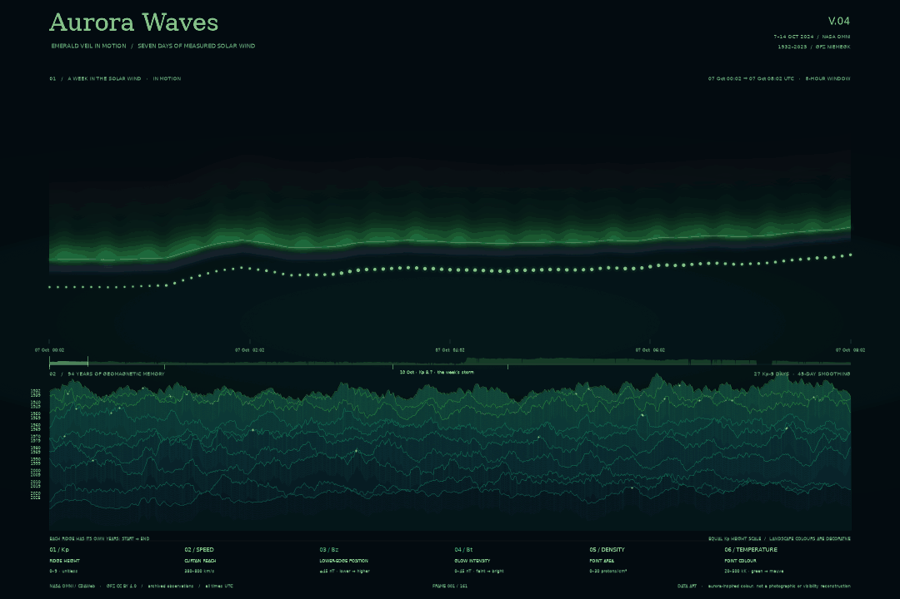

# Aurora Waves · V04 — A Week in the Solar Wind

> **This is the final version.** V04 is what the repository is submitted for. The working copy is at the [repository top level](../README.md); this folder is a read-only snapshot of the same thing. The raw data is not duplicated here — it lives once in `../data/`, so copy it in before re-running these scripts.
>
> **归档说明**：**这是最终版本（V04）**，也是本次提交的版本。使用中的副本在[仓库顶层](../README.md)，本文件夹是同一份内容的只读快照。原始数据不在这里重复存放，统一放在顶层 `data/`。



The image above is the final visualisation. It plays straight from this page. The animation itself is kept once, at the [repository top level](../out/), so this folder carries the still rather than a second copy of a 3.6 MB file. To see it full size rather than embedded here, open [`out/aurora-waves-v04-week-in-motion.gif`](../out/aurora-waves-v04-week-in-motion.gif) directly.

## What V04 does

V04 keeps V03's idea — a window sliding across the record — and widens the record from one day to seven. It draws 7–14 October 2024 UTC from NASA's OMNI archive [1]: the week of the geomagnetic storm of 10 October, when Kp reached 8.7 and Bz fell to −46 nT. The window is still eight hours wide and still advances one hour per frame, so the pace of the two animations matches even though the clock does not. 161 frames, 17.7 seconds.

Three things are new over V03:

- **The week strip.** A bare progress line says where you are; this says where you are *and* what the rest of the week looked like. It is the same curtain-reach encoding, compressed to all 2,016 five-minute bins, with the days that reached Kp 6 or above marked beneath it. Empty bins leave holes here exactly as they do in the sky above.
- **Re-scaled rulers.** V02 clamps Bz at ±5 nT and Bt at 6 nT, which suits a quiet day. This week reached −46 nT and 48 nT, so every frame would have been pinned to one colour. The three encodings are unchanged; their scales are widened to this week's own distribution, read off the 5th and 95th percentiles rather than guessed.
- **The poster frame** is not the middle of the loop but the frame containing the week's deepest Bz — the storm itself, snapped to the loop's grid so the still is exactly one of the frames.

## One thing that had to be corrected

The first measurement of the OMNI archive was pessimistic and wrong. Counting only minutes where all five quantities are valid *in the same minute*, the archive looked 18–36 per cent empty, and a week was reported as unusable. But the two instruments do not drop out together: over this week the magnetometer reports 95.8 per cent of minutes and the plasma instrument 79.6, and their gaps rarely overlap for long. Demanding they agree to the minute discards a fifth of the week for no physical reason — at most five minutes of alignment sits inside one clock bin.

So V04 averages each instrument over its own valid minutes within a shared five-minute bin, and a bin exists when both are present. Under that rule 1,921 of 2,016 bins are usable: 95.3 per cent of the week. What remains missing is kept missing — 95 empty bins, including one gap of about three hours and twenty minutes on 13 October. Nothing is interpolated across a gap, in the sky or in the strip. The curtain's glow fades softly into each gap rather than stopping dead, but the edge line still breaks and the light points still stop: the hole is there to be seen.

## Files here

| File | What it is |
|---|---|
| `out/aurora-waves-v04-poster.png` | The poster frame — the window holding the week's deepest Bz, 10 October 2024. The only picture stored in this folder. |
| `../out/aurora-waves-v04-week-in-motion.gif` | The final animation: 161 frames, 17.7 seconds, about 3.6 MB. Kept once, at the top level. |
| `aurora_waves_v04.py` | The final version. It imports its drawing from `aurora_waves_v02.py` rather than copying it, so the still and both animations share one implementation of the curtain. |
| `fetch_omni.py` | Fetches the archive week once from NASA's CDAWeb HAPI interface and saves the reply unchanged. |
| `aurora_waves_v02.py`, `aurora_waves_v03.py`, `aurora_waves.py`, `aurora_data.py` | The drawing and loading code V04 depends on. |
| `fetch.py`, `plot.py`, `test_data.py`, `test_v02.py` | The original fetcher and the checks, as they stood. |
| `PROCESS.md` | The write-up, including the correction described above. |

To run it, copy `../data/` in beside this README first, then:

```sh
uv run aurora_waves_v04.py
uv run aurora_waves_v04.py --window 12 --duration 140
```

## 中文说明

**这是最终版本（V04）**。它把时间轴从一天拉长到一周：因为 NOAA 的实时接口只保留 24 小时，这一周的数据改用 NASA 的 OMNI 档案（经由 CDAWeb 的 HAPI 接口抓取一次、原样存入 `data/`），选的是 2024 年 10 月 7–14 日——10 日发生了磁暴，Kp 达 8.7、Bz 低到 −46 nT。窗口仍是 8 小时宽、每小时推进一帧，所以节奏和第三版一致；新增了一条「周条」，把整整七天的光幕高度压缩成一条轮廓，并标出当前窗口的位置和磁暴那天。

编码方式与第二版相同，但刻度按这一周的真实分布放宽（否则整场磁暴会被压缩成一种颜色）。两台仪器的缺测时段不同，所以第四版改为「各自在自己有效的分钟内取平均、同一时钟窗口内两者都在场才算有效」，2016 个五分钟窗口里 1921 个可用（95.3%）；剩下的 95 个空窗全部如实留空，不插值补齐——光幕辉光在缺口处渐隐，但边线和光点仍然断开，缺口看得见。

看动画：本页顶部那张图会动；想全尺寸查看，直接点开 `out/aurora-waves-v04-week-in-motion.gif`。
