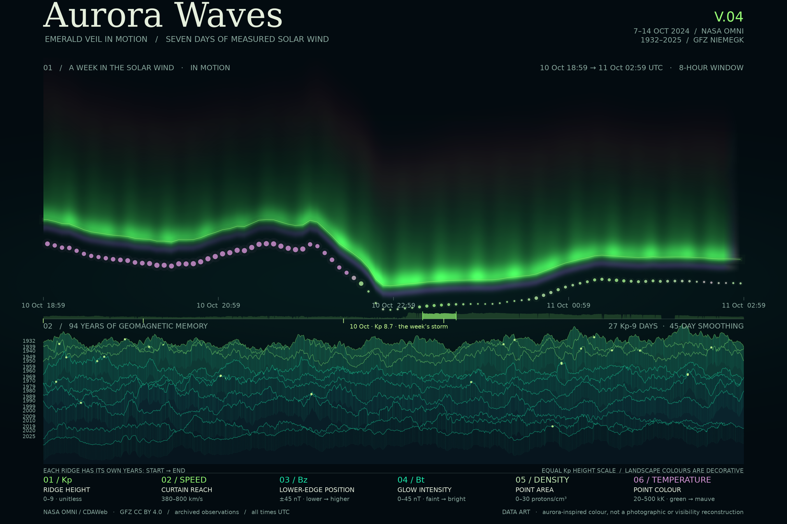
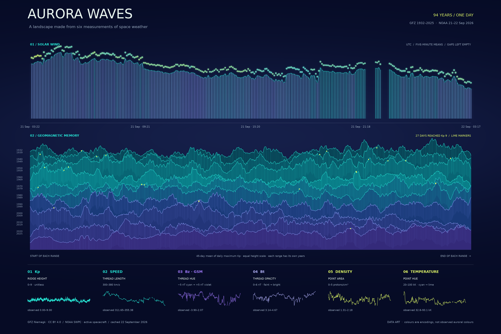
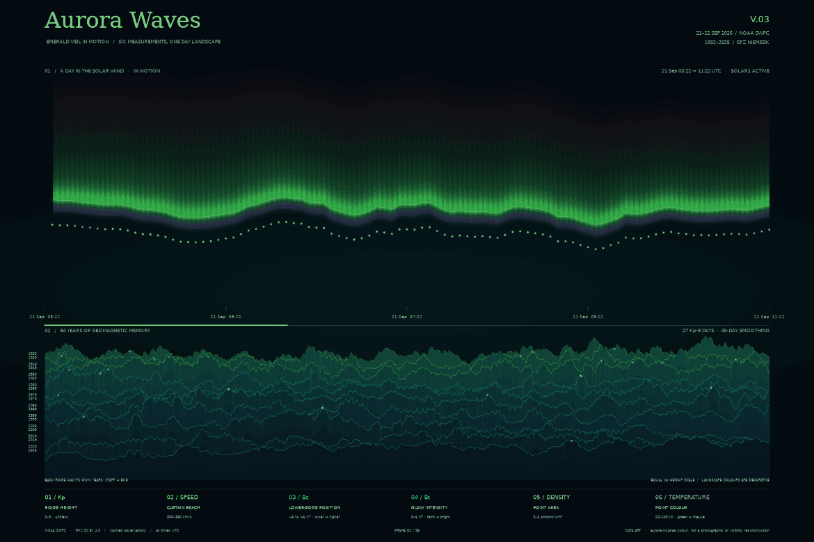
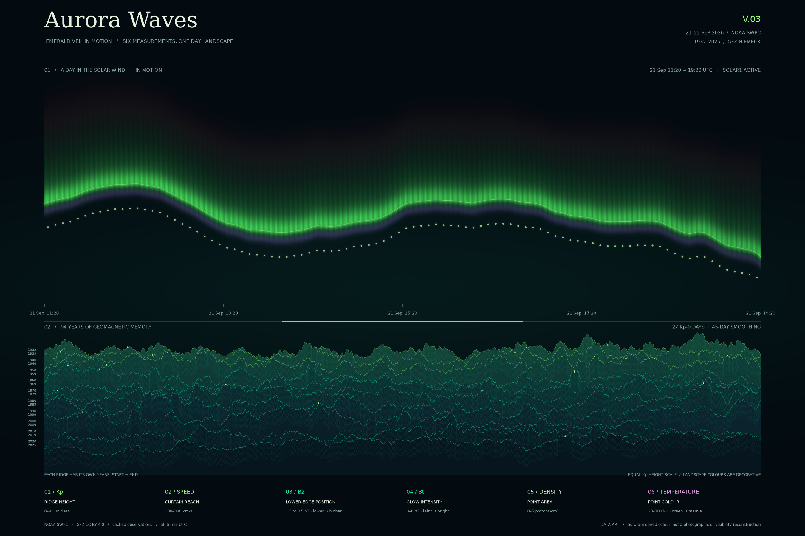

# Aurora Waves

**The final version is V04.** It draws one week of measured solar wind — 7–14 October 2024, the week of the geomagnetic storm of 10 October — through a window eight hours wide that slides across it.

- **[See it move →](out/aurora-waves-v04-week-in-motion.gif)** — the final visualisation. 161 frames, 17.7 seconds, loops. The link opens the file itself, so it plays full size.
- **[See the still →](out/aurora-waves-v04-poster.png)** — the frame containing the week's deepest Bz.
- **[Read the reasoning →](PROCESS.md)** — how each version was made, including one measurement that had to be corrected.



The picture above is the final version, V04: one week of measured solar wind drawn through a moving window, the frame chosen where Bz — the north–south component of the interplanetary magnetic field — reached its deepest point of the week. Pale green carries the brightest light, jade sits in the shadows, and a small purple border runs beneath the curtain. NOAA describes pale green as the most common auroral colour and notes that some auroras have a purple lower edge [1]. That informed the palette. The colours here are a design choice, not a reconstruction of what an observer would have seen.

The curtain uses solar-wind observations from NASA's OMNI archive, 7–14 October 2024 UTC [4] — the week of the geomagnetic storm of 10 October, when Kp reached 8.7 and Bz fell to −46 nT. The mountain ranges use 94 complete years of GFZ Kp data, 1932–2025 [3]. The sky and mountains have separate timelines: horizontal position in the sky is time within the week, while each mountain runs from the beginning to the end of its labelled years.

## Four versions in this repository

Every version has its own folder holding that version's scripts, README and pictures as they stood. The raw data is kept once, in `data/`, and all four read it from there. Open a folder to read the code behind a version; open one of the pictures to see it full size without running anything.

| Version | Its folder | Its picture | How it differs |
|---|---|---|---|
| **V04 — final** | [`Aurora-Waves-v4/`](Aurora-Waves-v4/) | [animation](out/aurora-waves-v04-week-in-motion.gif) · [still](out/aurora-waves-v04-poster.png) | A whole week, from the OMNI archive rather than the 24-hour live feed. The encodings are the same three as V02 with re-scaled rulers, plus a strip that shows all seven days at once with the moving window marked on it. |
| **V03** | [`Aurora-Waves-v3/`](Aurora-Waves-v3/) | [animation](out/aurora-waves-v03-emerald-veil-in-motion.gif) · [still](out/aurora-waves-v03-poster.png) | The same day as V02, drawn through a window eight hours wide that slides across it: the curtain flows, the mountains hold still. |
| **V02** | [`Aurora-Waves-v2/`](Aurora-Waves-v2/) | [still](out/aurora-waves-v02-emerald-veil.png) | Emerald Veil. Bz moves to the position of the curtain's lower edge, the bars become a fading light field softened only inside valid runs, and the palette follows the auroral colours NOAA describes. |
| **V01** | [`Aurora-Waves-v1/`](Aurora-Waves-v1/) | [still](out/aurora-waves.png) · [first look](out/aurora-first-look.png) | Jade-green ranges under a cyan-to-violet curtain. Bz is encoded as the curtain's thread hue, and the strands are hard vertical bars. |



*V01, the first version — where the four started.*

## V04 — a week in the solar wind *(the final version)*

Files and a copy of this write-up: [`Aurora-Waves-v4/`](Aurora-Waves-v4/).


*The loop covers all seven days in 17.7 seconds, one frame per hour of the record. The bright band in the middle is the storm; the week strip underneath shows the whole week with the window marked on it.*


V04 keeps V03's idea — a window sliding across the record — and widens the record from one day to seven. The window is still eight hours wide and still advances one hour per frame, so the pace of the two animations matches even though the clock does not. What is new:

- **The week strip.** A bare progress line says where you are; this says where you are and what the rest of the week looked like. It is the same curtain-reach encoding, compressed to all 2,016 five-minute bins, with the days that reached Kp 6 or above marked beneath it. Empty bins leave holes here exactly as they do in the sky above.
- **Re-scaled rulers.** V02 clamps Bz at ±5 nT and Bt at 6 nT, which suits a quiet day. This week reached −46 nT and 48 nT, so every frame would have been pinned to one colour. The three encodings are unchanged; their scales are widened to this week's own distribution.
- **The poster frame** is not the middle of the loop but the frame containing the week's deepest Bz — the storm itself, snapped to the loop's grid so the still is exactly one of the frames.

### Where the week came from, and why the first attempt failed

NOAA's free one-minute solar-wind feed only holds the last 24 hours, and the rolled 7-day files that used to sit beside it now answer 404. A week therefore has to come from the archive: NASA's OMNI, which merges what several spacecraft measured at L1 into one record per minute back to 1981 [4]. It is not live — CDAWeb serves it with a lag of a few weeks — but a week can be chosen rather than waited for.

The first measurement of this archive was pessimistic and wrong. Counting only minutes where *all five quantities* are valid *in the same minute*, the archive looked 18–36 per cent empty. But the two instruments do not drop out together: over this week the magnetometer reports 95.8 per cent of minutes and the plasma instrument 79.6, and their gaps rarely overlap for long. Demanding they agree to the minute discards a fifth of the week for no physical reason — at most five minutes of alignment sits inside one clock bin. So V04 averages each instrument over its own valid minutes within a shared five-minute bin, and a bin exists when both are present. Under that rule 1,921 of 2,016 bins are usable: 95.3 per cent of the week.

What remains missing is kept missing. Ninety-five bins are empty — 41 single-bin holes, seven gaps of five to fifteen minutes, and one gap of about three hours and twenty minutes on 13 October. The curtain's glow fades softly into each gap rather than stopping dead, but the edge line still breaks and the light points still stop: the hole is there to be seen. Nothing is interpolated across a gap, in the sky or in the strip.

## V03 — the curtain in motion

Files and a copy of this write-up: [`Aurora-Waves-v3/`](Aurora-Waves-v3/).



*The loop covers the whole day in 9.6 seconds, one frame every ten minutes of the record.*



V03 draws the same measurements as V02, but through a window instead of the whole day at once. The smoothing is computed once over the full record, so what a given minute looks like never depends on which frame happens to be on screen. The fine filament texture is tied to the data's own clock, so it travels with the curtain rather than shimmering underneath it, and the bright segment under the time axis shows where the visible window sits inside the day. The mountain ranges do not move: the 94-year Kp record has no clock. The GIF carries one shared 128-colour palette built from frames sampled across the loop, so the colours cannot flicker between frames.

V03 stayed inside one day because its source, NOAA's live feed, serves only the last 24 hours. The first attempt at a week from the OMNI archive looked hopeless and was dropped; V04 went back and measured it properly. That story is above.

## What the six measurements do

| Measurement | Encoding | V02 scale (a quiet day) | V04 scale (the storm week) |
|---|---|---|---|
| Historical Kp | Mountain height above its baseline | 0–9, unitless | 0–9, unitless |
| Solar-wind speed | Vertical reach of the curtain | 300–380 km/s | 380–800 km/s |
| Bz, GSM north–south component | Position of the curtain's lower edge | ±5 nT | ±45 nT |
| Bt, total magnetic field | Glow intensity | 0–6 nT | 0–45 nT |
| Proton density | Area of each light point | 0–5 protons/cm³ | 0–30 protons/cm³ |
| Proton temperature | Colour of each light point | 20,000–100,000 K | 20,000–500,000 K |

The V04 scales were read off this week's own five-minute bins, not guessed: the 5th and 95th percentiles of speed are 406 and 716 km/s, of Bt 3.7 and 33.2 nT. The fixed display scales clip values outside their limits. Curtain reach, glow intensity and point area include small visible minimums. The Bz encoding is a graphic position on the page, not a geographic position or altitude. The purple hem and faint red upper glow are colour styling; their presence does not prove particular emissions were measured. Fine vertical filaments and repeated mountain contours are drawing textures, not additional data points.

## Data and transformations

The original replies remain unchanged in `data/`. The source addresses are in `fetch.py` and `fetch_omni.py`.

| Saved file | Raw records | Meaning and use |
|---|---:|---|
| `gfz-kp-ap-since-1932.txt` | 276,784 | One three-hour Kp record; Kp is column eight. Daily maxima become historical ridges. |
| `omni-hro-1min-2024-10-07-to-10-14.csv` | 10,080 | One UTC minute per row from NASA's OMNI archive: Bt, Bz (GSM) in nT, speed in km/s, density in protons/cm³, temperature in K. The week that V04 draws. |
| `swpc-solar-wind-mag-1m.json` | 3,496 | One spacecraft's one-minute magnetic measurement; Bt and Bz in nT. The day that V02 and V03 draw. |
| `swpc-solar-wind-plasma-1m.json` | 3,374 | One spacecraft's one-minute speed, density and temperature measurement. |
| `swpc-planetary-k-index-1m.json` | 358 | Estimated Kp updates; retained for the plain first-look plot, not this image. |
| `swpc-ovation-aurora-latest.json` | 65,160 grid points | An exploratory aurora grid; retained but not used in this image. |

**V02 and V03.** The NOAA files contain several spacecraft. The parser selects active records, interprets timestamps as UTC, sorts them and joins valid plasma and magnetic measurements at exactly matching minutes. This snapshot supplies 1,362 paired minutes from SOLAR1, forming 276 usable five-minute bins. Twelve bins have fewer than three matching samples and remain empty. The curtain's shape and brightness add a centred nine-bin moving mean, equivalent to 45 minutes in a full valid run; short runs use a smaller odd window and edges use endpoint padding. Interpolation adds drawing pixels only within each valid run and never connects across a missing interval. Light-point area and colour retain the unsmoothed five-minute density and temperature values, while their positions follow the softened Bz edge. Each point represents one valid bin, not one physical particle.

**V04.** The OMNI file is parsed the same way, with one deliberate difference: each instrument is averaged over its own valid minutes inside a shared five-minute bin, and a bin exists only when both instruments are present. The reason is in the section above. 7,975 minutes carry both instruments at once; 1,921 of 2,016 bins are usable. The smoothing is the same nine-bin moving mean, computed once over the whole week, so a given moment never depends on which frame is on screen — and the dense sampling is 20,160 points, the same 120 samples per hour as V03.

Each historical ridge uses the same centred 45-day mean of daily maximum Kp as V01. Only complete calendar years enter the ranges; no extra leap days are invented. All 27 days reaching Kp 9 in those years are marked, although overlap can obscure some markers. Smoothing removes short fluctuations, overlap hides parts of the history, and the colour treatment does not predict aurora visibility. These are deliberate limits of a data artwork.

## Run V02

```sh
uv run aurora_waves_v02.py
```

This saves `out/aurora-waves-v02-emerald-veil.png` and opens a preview. To save without opening a window:

```sh
uv run aurora_waves_v02.py --no-show
```

Check the data and the gap-handling logic:

```sh
uv run aurora_data.py
uv run test_data.py
uv run test_v02.py
```

`fetch.py` reuses the cached files. The plotting scripts work offline once their dependencies are installed. The original `aurora_waves.py` is retained because V02 reuses its data-loading functions; running it still creates the separate V01 filename `out/aurora-waves.png`. Everything works the same from inside the archive folders, except that they share the single `data/` kept at the top level.

## Run V03

```sh
uv run aurora_waves_v03.py
```

This writes `out/aurora-waves-v03-emerald-veil-in-motion.gif` and the poster frame `out/aurora-waves-v03-poster.png`; it does not open a window. The window width, the loop length and the frame rate are adjustable:

```sh
uv run aurora_waves_v03.py --window 12        # wider window, calmer motion
uv run aurora_waves_v03.py --frames 64        # shorter loop, smaller file
uv run aurora_waves_v03.py --duration 130     # slower playback
```

Rendering imports the drawing code from `aurora_waves_v02.py` instead of copying it, so the still and the moving version cannot drift apart. About a minute for 96 frames on a laptop; the GIF lands around 5 MB.

## Run V04

```sh
uv run fetch_omni.py            # once; saves the archive week to data/
uv run aurora_waves_v04.py
```

This writes `out/aurora-waves-v04-week-in-motion.gif` (161 frames, 17.7 seconds, about 3.6 MB) and the poster frame `out/aurora-waves-v04-poster.png`. The same knobs as V03:

```sh
uv run aurora_waves_v04.py --window 12        # wider window, calmer motion
uv run aurora_waves_v04.py --frames 80        # shorter loop, smaller file
uv run aurora_waves_v04.py --duration 140     # slower playback
```

V04 imports its drawing from `aurora_waves_v02.py` as well, so the still and both animations share one implementation of the curtain. About ninety seconds for 161 frames on a laptop.

## References

[1] NOAA Space Weather Prediction Center. Aurora Tutorial [EB/OL]. [2026-09-22]. https://www.spaceweather.gov/content/aurora-tutorial

[2] NOAA Space Weather Prediction Center. Solar Wind [EB/OL]. [2026-09-22]. https://www.spaceweather.gov/products/solar-wind

[3] GFZ Helmholtz Centre for Geosciences. Data: Kp index [EB/OL]. [2026-09-22]. https://kp.gfz.de/en/data . Historical data: Geomagnetic Observatory Niemegk, CC BY 4.0, as credited in the raw file.

[4] NASA Goddard Space Flight Center. OMNI Web interface, 1-minute near-Earth solar wind magnetic field and plasma data (OMNI_HRO_1MIN), served through the CDAWeb HAPI interface [EB/OL]. [2026-09-22]. https://cdaweb.gsfc.nasa.gov/hapi/info?id=OMNI_HRO_1MIN . OMNI data are a synthesis of multiple spacecraft at L1; the file fetched here covers 2024-10-07 to 2024-10-14.

## 中文说明

这是单独保存的第二版：`aurora_waves_v02.py` 对应 `aurora-waves-v02-emerald-veil.png`，不会覆盖第一版。新版保留六项数据，把极光绿作为主色，辅以青绿、少量紫色下缘和红色辉光。Bz 改为控制光幕下缘的位置，让主体颜色更接近极光观感。光幕经过 45 分钟柔化，但缺测位置仍留空；光点面积和颜色保留五分钟数据的变化。这里呈现的是数据艺术，不是实拍照片或极光可见性预测。

四个版本各有一个归档文件夹：`Aurora-Waves-v1/` 到 `Aurora-Waves-v4/`，里面分别放着那一版的脚本、说明和成品图。**最终版本是第四版（V04）**，使用中的副本在顶层（也就是本页），同一份内容也已归档到 `Aurora-Waves-v4/`。原始数据只保存一份，放在顶层 `data/`，四个版本共用。

想直接看可视化，不用跑任何代码：点开 `out/aurora-waves-v04-week-in-motion.gif` 就是最终版的动画（GitHub 上会直接播放），点开 `out/aurora-waves-v04-poster.png` 是最终版的静帧；其余三版的成品图同样可以直接点开查看（见上文表格里的链接）。

第三版 `aurora_waves_v03.py` 在第二版的基础上加了帧动画：把一天 24 小时的太阳风通过一个 8 小时宽的滑动窗口呈现，让绿色光幕流动起来，山峦保持静止（94 年的 Kp 记录本身没有时间轴）。整个循环 9.6 秒、96 帧、约 5 MB，全部帧共用同一套 128 色调色板，避免颜色闪烁；时间轴下方那条亮绿色的短线，标出当前窗口在一天中的位置。

第四版 `aurora_waves_v04.py` 把时间轴从一天拉长到一周。因为 NOAA 的实时接口只保留 24 小时，这一周的数据改用 NASA 的 OMNI 档案（经由 CDAWeb 的 HAPI 接口抓取一次、原样存入 `data/`），选的是 2024 年 10 月 7–14 日——10 日发生了磁暴，Kp 达 8.7、Bz 低到 −46 nT。窗口仍是 8 小时宽、每小时推进一帧，所以节奏和第三版一致；新增了一条「周条」，把整整七天的光幕高度压缩成一条轮廓，并标出当前窗口的位置和磁暴那天。编码方式与第二版相同，但刻度按这一周的真实分布放宽（否则整场磁暴会被压缩成一种颜色）。两台仪器的缺测时段不同，所以第四版改为「各自在自己有效的分钟内取平均、同一时钟窗口内两者都在场才算有效」，2016 个五分钟窗口里 1921 个可用（95.3%）；剩下的 95 个空窗全部如实留空，不插值补齐——光幕辉光在缺口处渐隐，但边线和光点仍然断开，缺口看得见。
